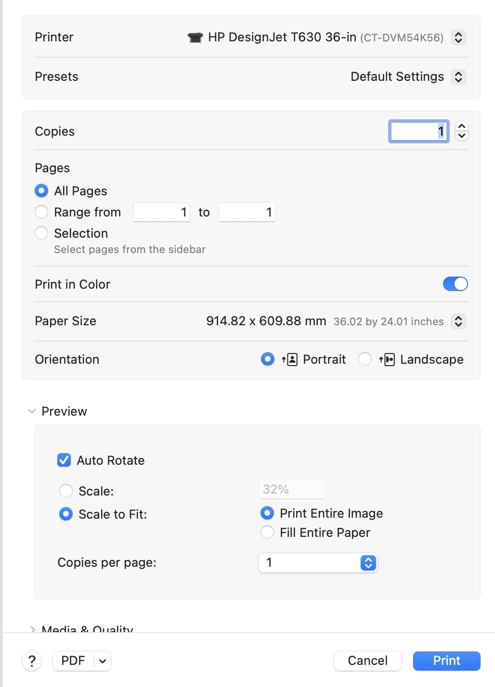

## HP DesignJet T630

Amaranth's poster printer, the HP DesignJet T630 allows for prints up to 36 inches.
The printer uses inkjet cartridges, which are expensive to replace, so please read through the below tips to save resources.

## Print Dialog Box

The below screenshot shows the correct settings for sending a print to the poster printer.

 

 
