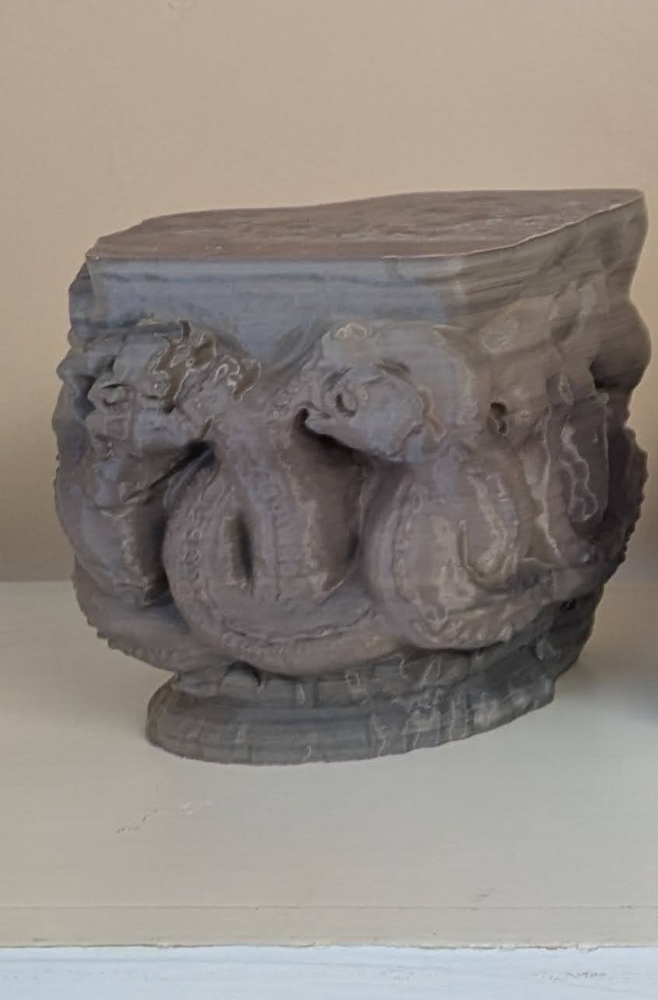
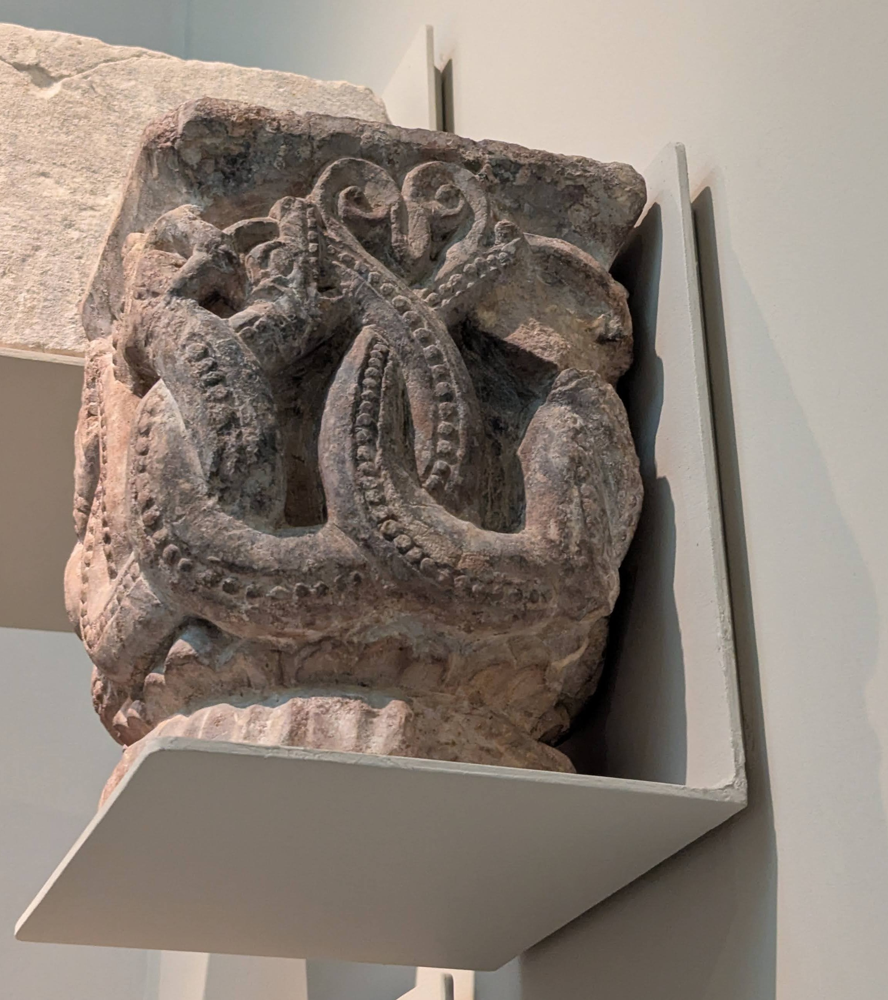
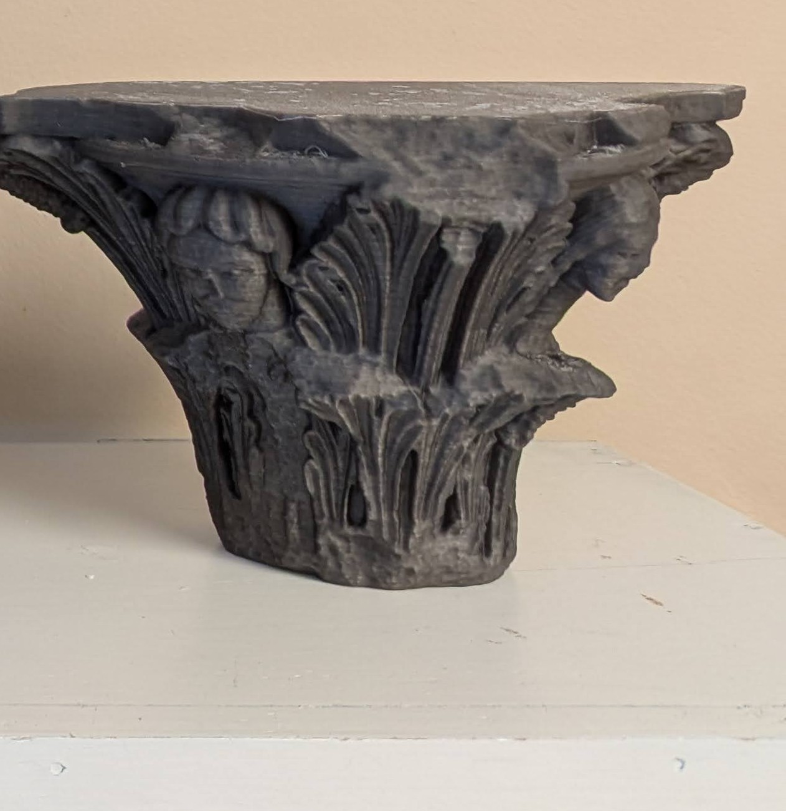
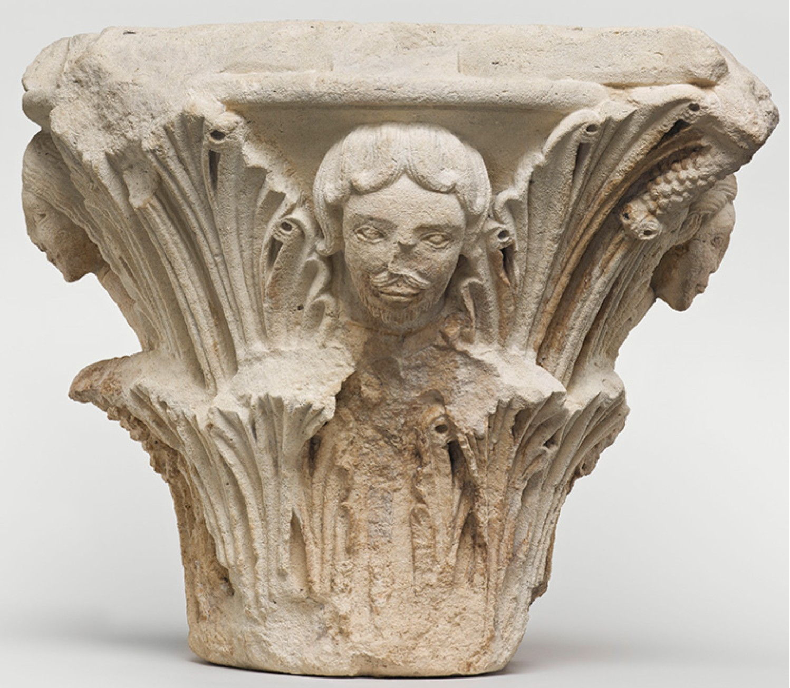
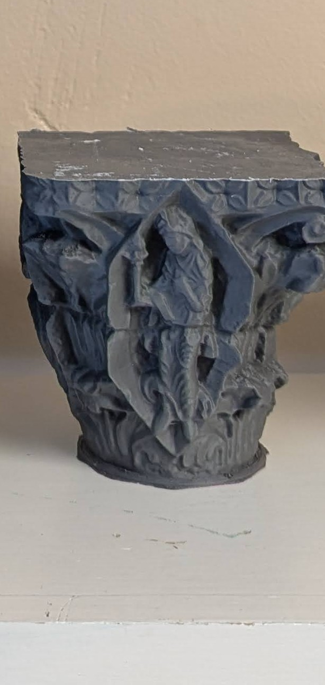
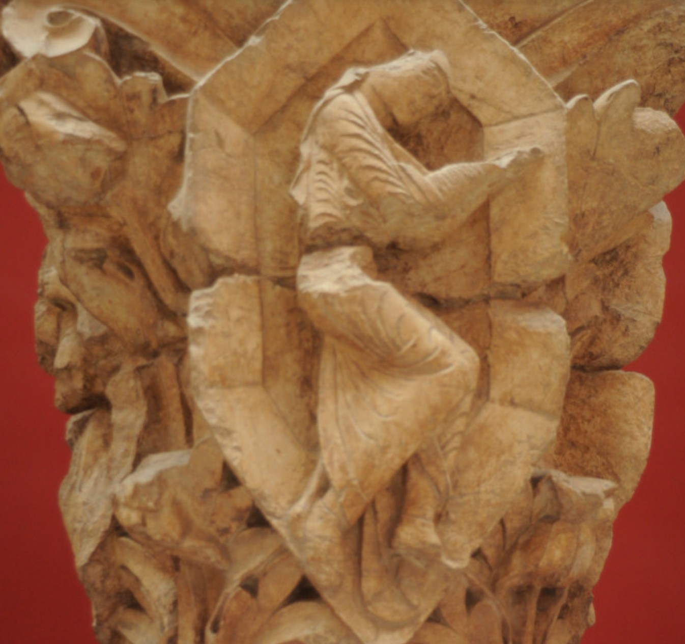
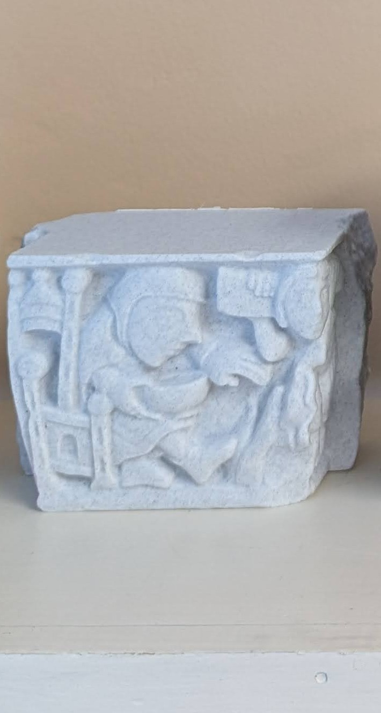
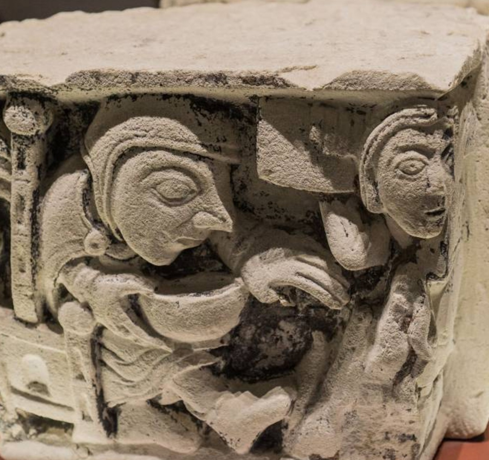
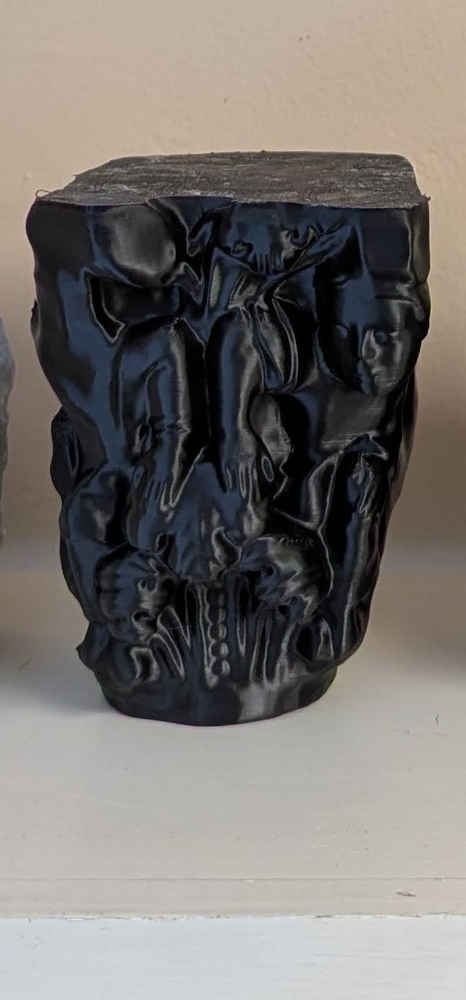
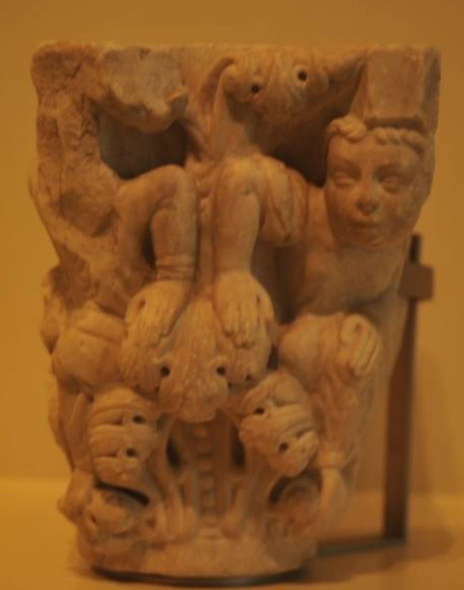

# 3D-Printed Medieval Capitals

This use case explores the use of 3D printing to help create deeper understanding of medieval architectural styles.

## Project Summary

Printing a series of objects increases the pedagogical value of 3D objects because students can compare them. While 2D images might very well convey most of the information described below, the experience of connecting to multiple 3D objects will likely make a substantial difference in students' retention of that information. We selected five 3D files of medieval capitals from a repository called [Scan the World](https://www.myminifactory.com/scantheworld/about) and printed them in a variety of colors. Although the detail of the scans sometimes limited the sharpness of the print quality, the capitals successfully convey key differences between Romanesque and Gothic architectural features. We created a large poster to demonstrate the potential for contextualizing 3D printed objects in a display.

## Pedagogical Goals

The central learning outcome desired for this project was to help students retain a long-term understanding of Romanesque and Gothic architectural styles. The table below summarizes the main differences of these two styles, ones that largely dominate the architecture in western Europe during the Middle Ages.

  <table class="table table-bordered">

| Feature | Romanesque Style | Gothic Style |
| --------- | ---------- | ---------- |
| Time Period | Early medieval, ca. 1000-1200 | High and Late Medieval, ca. 1100-1500 |
| Treatment of Forms from Nature | Strong lines of highly stylized leaves, based on Roman models | A more realistic portrayal |
| Treatment of Plants | Curling stems, knot-work, scrolling | Accurate reproduction of leaf forms |
| Treatment of Animals | Included fantastic beasts | Animals from Biblical stories, depicted with more realism |
| Human Form | Expressive, but abstract | Curving figures, emphasis on realistic portrayal of strong emotion |
| Key Buildings | Shrine of St. James in Santiago de Compostela | Cathedral of Saint Denis in Paris, Cathedral of Notre Dame in Paris |
| Building Features | Rounded arches with chevrons | Large windows, pointed arches, flying buttresses to support stone ceiling vaults |

  </table>

## Sourcing the 3D Files

Very few museums currently produce 3D files of the kind required for printing. Several museums, such as the [Smithsonian](https://3d.si.edu/), offer 3D scans of objects viewable on traditional web browsers and in VR headsets. However, most of those scans convey depth through color shading in 2D. For a printable 3D file, the object must be scanned with infrared or LiDAR. Some new apps attempt to use the processing power of AI to transfer 2D images into 3D printable files, but those tools do not yet produce satisfactory detail. 

For this project we relied on the 3D scanning done by several volunteers who contributed to the Scan the World Project. Even though their scanning resulted in enough detail for 3D printing, the lack of fine detail demonstrates the limits of amateur 3D scanning with small handheld devices. Under more suitable lighting conditions and with more powerful scanners, museums might one day provide 3D printable files that more closely imitate the texture of the original object. 

The Scan the World Project's [collection](https://www.myminifactory.com/users/Scan%20The%20World) includes over two dozen medieval capitals. In choosing from the available capitals, we attempted to pick five that effectively demonstrate features of Romanesque and Gothic styles. The table below lists the capitals we printed and their stylistic features.

| Image of the 3D Model | Image of original | Location | Date | Description of Style |
| --------- | ---------- | ---------- |
|  |  | London, possibly from All Hallows Church | ca. 12th century | This squat capital decorated with intertwined serpents reflects Romanesque style in the knot-like way the serpents intertwine and the fantastical quality of the animal depiction. |
|  |  | Cathedral of St. Denis near Paris | ca. 1140-1144 | Demonstrates emergence of Gothic style through narrow vertical length, more realistic human faces, and reactivated acanthus leaf theme from early Christianity. |
|  |  | Church of St. Peter and Paul in Wissembourg | ca. 1140 | The curving human figure and more accurate leaf forms reflect the strong Gothic style of this capital. |
|  |  | Basilica of Our Lady in Maastricht | ca. 12th century | The abstract human figures, expressive but not realistically portrayed, reflect the persistence of Romanesque at the time of the emergence of Gothic. The squat shape of the capital also links it to Romanesque style. |
|  | | Hospital of St. Nicolau in Barcelona | ca. 1200-1220 | The Romanesque influence in this capital is observable in its squat shape and curling foliage but the emotional expression on the righthand human figure hints at Gothic influence. |

## Pedagogical Use of the 3D Capitals

An instructor wishing to supplement a short lecture on Romanesque and Gothic styles may borrow the capitals from the Amaranth studio. During or after the lecture, students can hold and inspect the 3D models in order to reinforce what they learned. We also encourage the instructor to lead the students in a critique of the accuracy of the 3D models so that they can appreciate the challenges as well as the opportunities for 3D representation of historical artifacts.

In the Amaranth studio space, the poster below, printed at 36x47 inches, explains the pedagogical intentions of the printed capitals. This creates an opportunity for communication of the pedagogical utility of the capitals outside of the classroom setting. We hope that this sparks ideas for the pedagogical potential of additional series of 3D objects to demonstrate themes from other historical contexts.

{% include figure.html
  class="left"
  width="60%"
  caption="Medieval Capitals Poster"
  image-url="images/capitals-poster.jpg"
%}

